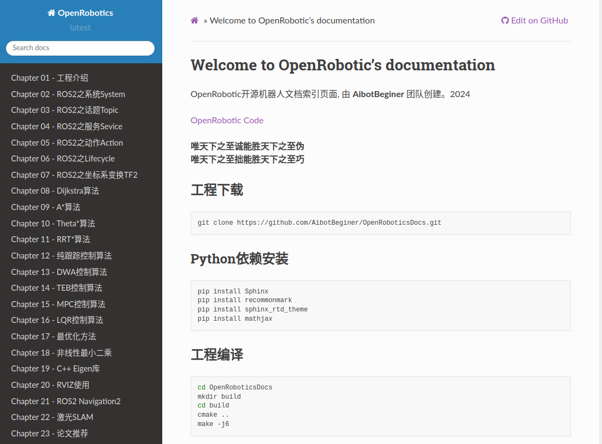

# OpenRoboticsDocs

OpenRobotic开源机器人文档, 由 **AibotBeginer** 团队创建。2024

唯天下之至诚能胜天下之至伪, 
唯天下之至拙能胜天下之至巧

[在线OpenRobotic开源机人文档网站](https://openroboticsdocs.readthedocs.io/en/latest/index.html#)

<a href ="https://openroboticsdocs.readthedocs.io/en/latest/index.html"></a>


## 工程下载

```bash
   git clone https://github.com/AibotBeginer/OpenRoboticsDocs.git
```


## Python依赖安装

```bash
   pip install Sphinx
   pip install recommonmark
   pip install sphinx_rtd_theme
   pip install mathjax
```


## 工程编译

```bash
   cd OpenRoboticsDocs
   mkdir build
   cd build
   cmake ..
   make -j6
```

## 查看文档

```bash
   cd OpenRoboticsDocs/build
   使用浏览器打开文件: html/index.html
```

## QQ社区交流


