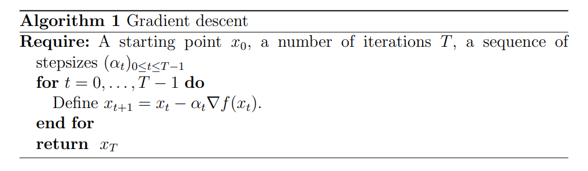
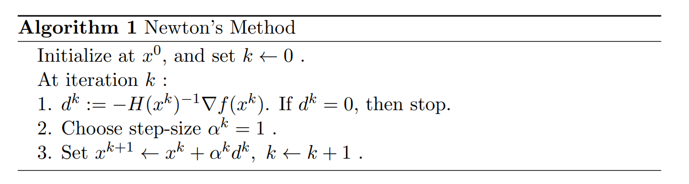
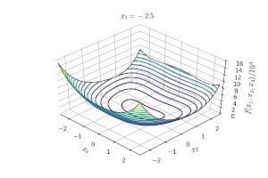
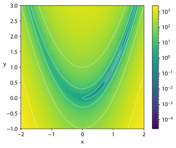
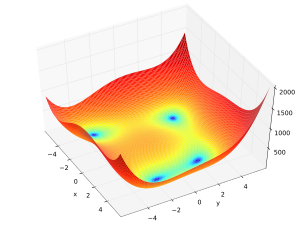
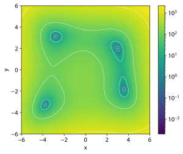

=================
最优化方法
=================

梯度下降法
=================

梯度下降法定义
-----------------

梯度下降法（Gradient desent） 是一个一阶最优算法，通常也称为最速下降法。要使用梯度下降法找到一个函数的局部极小值，
必须向函数上当前点对应梯度（或者是近似梯度）的反方向的规定步长距离点进行迭代搜索。如果相反地梯度正方向迭代进行搜索，
则会接近函数的局部极大值点；这个过长被称为梯度上升法。

梯度下降基本过程
-----------------

梯度下降法如下：

   Gradient descent method.

注意：以上叙述只是给出了一个梯度下降算法的一般框架，实际应用过程中，还应灵活变换该框架使其符合实际。

牛顿算法
=================

牛顿法定义
-----------------

牛顿法主要应用在两个方面，1：求方程的根；2：最优化。

牛顿法基本过程
-----------------

梯度下降法如下：

   Newton method method.

牛顿法的优缺点
-----------------

| **优点** ： 二阶收敛，收敛速度快
| **缺点** ：牛顿法是一种迭代算法，每一步都需要求解目标函数的Hessian矩阵的逆矩阵，计算比较复杂

拟牛顿算法
=================

牛顿法
-----------------

牛顿法（经典牛顿法）的迭代表达式：

    .. math::

        x^{k+1} = x^k  - \nabla^2 f(x^k)^{-1} \nabla f(x^k)

但是，牛顿法过程中 Hessian 矩阵 :math:`\nabla^2 f(x^k)^{-1}` 的计算和存储的代价很高，对于条件数较多的问题很难求解。因此，引入 **拟牛顿法**。

拟牛顿法
-----------------

**拟牛顿法** 的核心思路在于，在牛顿法的迭代过程中，用 **近似解** 计算第 :math:`k` 次迭代下的 Hessian 矩阵 :math:`\nabla^2 f(x^k)` ，近似值记为 :math:`B^k` ，即有 :math:`B^k \approx \nabla^2 f(x^k)` ，称为 **拟牛顿矩阵**。

用 **近似值** :math:`B^k` 代替牛顿法中的 :math:`\nabla^2 f(x^k)`，得：

    .. math::

        x^{k+1} = x^k - B(x^k)^{-1} \nabla f(x^k)

在近似 Hessian 矩阵时，也需要通过 **某种映射关系** 并 **不断迭代** 得到。但是依然需要求近似矩阵的逆，为了避免计算逆矩阵的开销，我们可以 **直接近似** Hessian **矩阵的逆**，记 :math:`H^k = (B^k)^{-1}` 。故我们有：

    .. math::

        x^{k+1} = x^k - H^k\nabla f(x^k)  \\

        H^{k+1} = g(H^k)

其中 :math:`g` 为 **近似** Hessian **矩阵的逆** 的映射函数。一般有 :math:`H^{k+1} = H^k +C^k`，其中 :math:`C^k` 被称为 **修正矩阵**。

拟牛顿法基本过程
--------------------

* 令 :math:`H^0 = I`，任选初始点 :math:`x^0 \in \mathbb {R}^n`，令:math:`k = 0`
* 计算 **梯度** :math:`\nabla f(x^k)` ，如果满足终止条件 :math:`|| \nabla f(x^k)|| \lt \epsilon`，取 :math:`x^{*} = x^k`，并结束整个算法
* 计算 **搜索方向** :math:`d^k = -H^k \nabla f(x^k)` ， :math:`H^k` 为当前 :math:`x^k` 处的Hessian 矩阵的近似
* 迭代更新 :math:`x: x^{k+1} = x^{k} + d^k`
* 更新 :math:`H: H^{k+1} = g(H^k)` 根据 :math:`x^k` 点的信息进行简单修正

拟牛顿法 :math:`H^k` 的确定
--------------------------------

设 :math:`f(x)` 是二阶连续可微函数，对 :math:`\nabla f(x)` 在点 :math:`x^{k+1}` 处进行一阶泰勒近似，得：

    .. math::

        \nabla f(x) = \nabla f(x^{k+1}) + \nabla ^2f(x^{k+1})(x - x^{k+1}) + O(|| x - x^{k+1}||^2)

令 :math:`x = x^k` ，设 :math:`s^k = x^{k+1} - x^{k}` 为 **点差**， :math:`y^k = \nabla f(x^{k+1}) - \nabla f(x^{k})` 为 **梯度差**，得：

    .. math::

        \nabla ^2f(x^{k+1})s^k + O(|| s^k ||^2) = y^k

忽略高阶项 :math:`O(|| s^k ||^2)` ，由此可以得到：

    .. math::

        \nabla ^2f(x^{k+1})s^k = y^k

所以，我们希望 **近似** Hessian **矩阵** :math:`B^{k+1}` 满足方程：

    .. math::

        B^{k+1}s^k = y^k

因此 **近似** Hessian **矩阵的逆** :math:`H^{k+1}` 满足：

    .. math::

        H^{k+1}y^k = s^k

上述的两个方程被称为 **割线方程**。

SR1方法
=================

SR1 定义
-----------------

SR1 方法 （秩一更新 Symmetric Rank-One）的核心思路很简单，即 根据 :math:`x^k` 处的信息得到修正量 :math:`\Delta{H}^k` 来更新 :math:`{H}^k` ，即：

    .. math::

        H^{k+1} = H^k + \Delta{H}^k

我们希望 :math:`H^k \approx  \nabla^2f(x^k)^{-1}` ， :math:`H^{k+1} \approx  \nabla^2f(x^{k+1})^{-1}` 故有：

    .. math::

        \Delta {H}^k \approx \nabla^2f(x^{k+1})^{-1} - \nabla^2f(x^k)^{-1}

需要保证 :math:`H^k` 和 :math:`H^{k+1}` 都是对称的，故显然 :math:`\Delta {H}^k` 也是对称的。所以令 :math:`\beta \in \mathbb{R^n}, \,u \in \mathbb{R^n}` ，
使得 :math:`\Delta {H}^k = \beta \mu \mu^T` ，故 :math:`H` 的迭代更新表达式为：

    .. math::

        H^{k+1} = H^k + \beta \mu \mu^T

显然 :math:`\beta \mu \mu^T` 是一个 :math:`n \times n` 的 **对称矩阵**。:math:`\beta` 是待定的标量，:math:`\mu` 是待定的向量。

SR1 更新公式
-----------------

根据 **割线方程** :math:`H^{k+1}y^k = s^k` ，代入 SR1 更新的结果，得到：

    .. math::

        (H^k + \beta \mu \mu ^T)y^k = s^k

整理可得：

    .. math::

        \beta \mu \mu^T y^k = (\beta\mu^T y^k)\mu = s^k - H^ky^k

其中可以得出 :math:`\beta \mu^T y^k` 是一个 **标量** ，因此上式表明 **向量** :math:`\mu` 和 :math:`s^k - H^ky^k` **同向** 。故有：

    .. math::

        \mu = \frac{1}{\beta \mu^T y^k}(s^k - H^ky^k)

记 :math:`\frac{1}{\beta \mu^T y^k} = \gamma` ，得：

    .. math::

        \mu = \gamma(s^k - H^ky^k)

将 :math:`\mu` 回代到 :math:`\beta \mu \mu^T y^k = s^k - H^ky^k` ，得：

    .. math::

        s^k -  H^ky^k= \beta \gamma^2(s^k - H^ky^k)(s^k - H^ky^k)^Ty^k

由于 :math:`\beta \gamma^2` 和 :math:`(s^k - H^ky^k)^Ty^k` 都是 **标量**，上式可以写成：

    .. math::

        s^k -  H^ky^k = [\beta \gamma^2(s^k - H^ky^k)^Ty^k](s^k - H^ky^k)

显然只有在 :math:`\beta \gamma^2(s^k - H^ky^k)^Ty^k = 1` 时，等式成立。

因此，我们可以得到：

    .. math::

        \beta \gamma^2 = \frac{1}{(s^k - H^ky^k)^Ty^k}

将上式 :math:`\beta \gamma^2` 回代到 **迭代更新表达式** :math:`H^{k+1} = H^k + \beta \mu \mu^T` ：

    .. math::

        \begin{aligned}
        H^{k+1} &= H^k + \beta \mu \mu^T    \\
                &= H^k + \beta \gamma^2(s^k - H^ky^k)(s^k - H^ky^k)^T    \\
                &= H^k + \frac{\beta \gamma^2(s^k - H^ky^k)(s^k - H^ky^k)^T}{(s^k - H^ky^k)^Ty^k}
        \end{aligned}

记 :math:`v = s^k - H^ky^k` ，那么上述更新表达式可以化简为：

    .. math::

        H^{k+1} = H^{k} + \frac{vv^T}{v^Ty^k}
        
由此得到了最终 SR1 **方法** 的 **更新公式**。

SR1 的缺点
-----------------

* 在迭代过程中 无法保证$B^k$正定，也就是说 **搜索方向不一定下降**。而且即使 :math:`B^k` **正定**，也 **不一定保证** :math:`B^{k+1}`
* **无法保证** :math:`v^{T}y^k` **恒大于 0**，因此也可能会导致后续的 :math:`B^{k+1}` **非正定**

BFGS 方法
=================

BFGS 定义
-----------------

BFGS方法考虑的是 对 :math:`B^k` 进行秩二更新。对于拟牛顿矩阵 :math:`B^k \in \mathbb {R}^{n \times n}` ，
设 :math:`\mu \neq 0, \nu \neq 0, \mu, \nu \in \mathbb {R}^n` 以及 :math:`a ,b \in \mathbb {R}` ，其中设定的向量和标量都是待定的，
则有 **秩二更新表达式**：

    .. math::

        B^{k+1} = B^{k} + a\mu \mu^T + b\nu \nu^T
        
显然 :math:`a\mu \mu^T` 和 :math:`b\nu \nu^T` 都是对称的。

BFGS 更新公式
-----------------

根据 **割线方程** :math:`B^{k+1}s^k = y^k` ，代入 **待定参量**，得：
    
    .. math::

        B^{k+1} = (B^{k} + a\mu \mu^T + b\nu \nu^T)s^k = y^k
        
整理可得：

    .. math::

        a\mu \mu^Ts^k + b\nu \nu^Ts^k = (a\mu^Ts^k)\mu + (b \nu^Ts^k)\nu  = y^k - B^ks^k
        
可以得出 :math:`a\mu^Ts^k` 和 :math:`b \nu^Ts^k` 为 **标量**，不妨取 :math:`(a\mu^Ts^k)\mu = y^k,(b \nu^Ts^k)\nu = -B^ks^k` ，所以可以得到如下取值

    .. math::

        a\mu^Ts^k = a, \mu = y^k, b \nu^Ts^k = -1, \nu = B^ks^k
        
化简可得所有 **待定参量的取值**：

    .. math::

        a = \frac{1}{\mu^Ts^k} = \frac{1}{(y^k)^Ts^k}   \\

        b = -\frac{1}{\nu^Ts^k} = -\frac{1}{(B^ks^k)^Ts^k} = \frac{1}{(s^k)^TB^ks^k}
    

将上述取值回代到 **更新表达式** :math:`B^{k+1} = B^{k} + a\mu \mu^T + b\nu \nu^T` ，得:

    .. math::

        B^{k+1} = B^{k} +  \frac{y^k(y^k)^T}{(y^k)^Ts^k} - \frac{B^ks^k(s^k)^TB^k}{(s^k)^TB^ks^k}

测试函数
=================

Rosenbrock函数
-----------------

* Rosenbrock函数定义

.. math::

    f(x, y) = (a - x)^2 + b(y - x^2)^2

其中全局最小值 :math:`(x, y) = (a, a^2)` , 当 :math:`a = 1, b = 100`

.. math::

    f(x, y) = (1 - x)^2 + 100(y - x^2)^2

* Rosenbrock函数Gradient

.. math::

    \nabla {f} = 
        \begin{bmatrix}
            -400xy + 400x^3 + 2x -2 \\
            200y - 200x^2
        \end{bmatrix}

* Rosenbrock函数Hessian

.. math::

    \nabla^2 {f} = 
        \begin{bmatrix}
            -400y + 1200x^2 + 2 & -400x \\
            -400x & 200
        \end{bmatrix}

Himmelblau's函数
-----------------

* Himmelblau's函数定义

.. math::

    f(x, y) = (x^2 + y - 11)^2 + (x + y^2 - 7)^2

其中全局最小值 :math:`(x, y) = (3, 2), (-2.805118, 3.131312), (-3.779310, -3.283186), (3.584428, -1.848126)`

* Himmelblau's函数Gradient

.. math::

    \nabla {f} = 
        \begin{bmatrix}
            4x^3 + 4xy - 42x + 2y^2 - 14 \\
            2x^2 + 4y^3 - 26y - 22
        \end{bmatrix}

* Himmelblau's函数Hessian

.. math::

    \nabla^2 {f} = 
        \begin{bmatrix}
            12x^2 + 4y - 42 & 4x + 4y \\
            4x + 4y & 12y^2 - 26
        \end{bmatrix}

梯度下降法函数测试
======================

Python代码

.. code::

    

牛顿法函数测试
=================

Python代码

.. code::

    #!/usr/bin/python
    # -*- coding: utf-8 -*-

    import matplotlib.pyplot as plt
    import numpy as np
    import random

    delta = 0.1
    minXY=-5.0
    maxXY=5.0
    nContour=50
    alpha=0.01

    def Hessian(state):
        u"""
        Hessian matrix of Himmelblau's function
        """
        x=state[0]
        y=state[1]
        dxx=12*x**2+4*y-42;
        dxy=4*x+4*y
        dyy=4*x+12*y**2-26
        H=np.array([[dxx,dxy],[dxy,dyy]])
        return H
        

    def Jacob(state):
        u"""
        jacobi matrix of Himmelblau's function
        """
        x=state[0]
        y=state[1]
        dx=4*x**3+4*x*y-44*x+2*x+2*y**2-14
        dy=2*x**2+4*x*y+4*y**3-26*y-22
        J=[dx,dy]
        return J

    def HimmelblauFunction(x,y):
        u"""
        Himmelblau's function
        see Himmelblau's function - Wikipedia, the free encyclopedia 
        http://en.wikipedia.org/wiki/Himmelblau%27s_function
        """
        return (x**2+y-11)**2+(x+y**2-7)**2

    def CreateMeshData():
        x = np.arange(minXY, maxXY, delta)
        y = np.arange(minXY, maxXY, delta)
        X, Y = np.meshgrid(x, y)
        Z=[HimmelblauFunction(x,y) for (x,y) in zip(X,Y)]
        return(X,Y,Z)

    def NewtonMethod(start,Jacob):
        u"""
        Newton Method Optimization
        """

        result=start
        x=start

        while 1:
            J=Jacob(x)
            H=Hessian(x)
            sumJ=sum([abs(alpha*j) for j in J])
            if sumJ<=0.01:
                print("OK")
                break

            grad=-np.linalg.inv(H).dot(J) 
            print(grad)

            x=x+[alpha*j for j in grad]
            
            result=np.vstack((result,x))

        return result

    # Main
    start=np.array([random.uniform(minXY,maxXY),random.uniform(minXY,maxXY)])

    result=NewtonMethod(start,Jacob)
    (X,Y,Z)=CreateMeshData()
    CS = plt.contour(X, Y, Z,nContour)
    #  plt.clabel(CS, inline=1, fontsize=10)
    #  plt.title('Simplest default with labels')

    plt.plot(start[0],start[1],"xr");

    optX=[x[0] for x in result]
    optY=[x[1] for x in result]
    plt.plot(optX,optY,"or-");

    plt.show()

拟牛顿法函数测试
=================

Python代码

.. code::

参考
=================

* https://www.cnblogs.com/MAKISE004/p/17904431.html
* https://zhuanlan.zhihu.com/p/144736223
* https://www.cnblogs.com/MAKISE004/p/17904431.html
