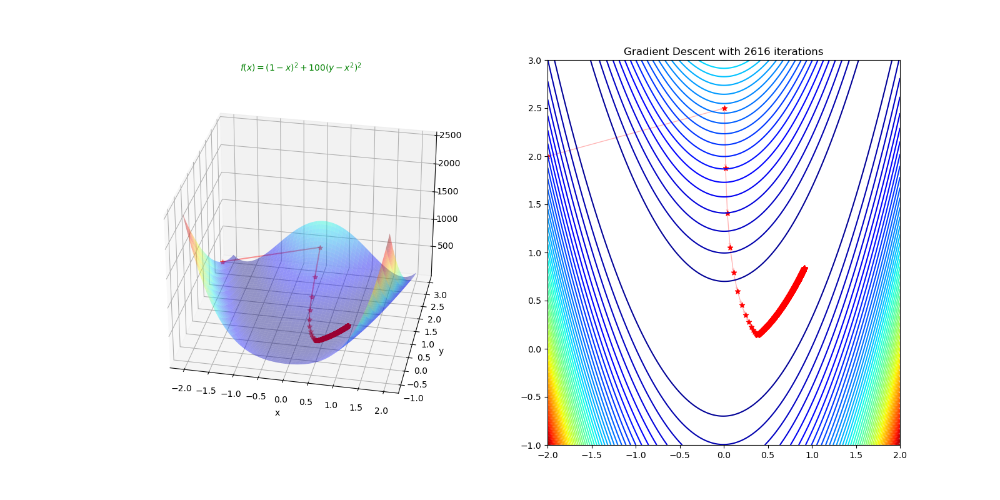
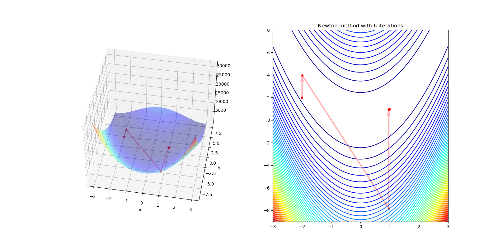
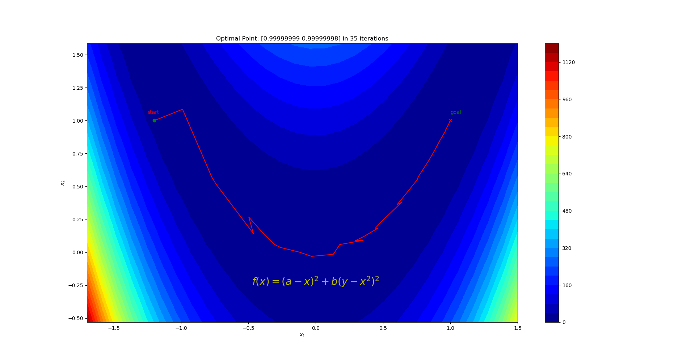

=================
最优化方法
=================

梯度下降法
=================

梯度下降法定义
-----------------

梯度下降法（Gradient desent） 是一个一阶最优算法，通常也称为最速下降法。要使用梯度下降法找到一个函数的局部极小值，
必须向函数上当前点对应梯度（或者是近似梯度）的反方向的规定步长距离点进行迭代搜索。如果相反地梯度正方向迭代进行搜索，
则会接近函数的局部极大值点；这个过长被称为梯度上升法。

梯度下降基本过程
-----------------

梯度下降法如下：

.. figure:: ./images/gradient_descent_method.png
   :align: center

   Gradient descent method.

注意：以上叙述只是给出了一个梯度下降算法的一般框架，实际应用过程中，还应灵活变换该框架使其符合实际。

牛顿算法
=================

牛顿法定义
-----------------

牛顿法主要应用在两个方面，1：求方程的根；2：最优化。

牛顿法基本过程
-----------------

梯度下降法如下：

.. figure:: ./images/newton_method.png
   :align: center

   Newton method method.

牛顿法的优缺点
-----------------

| **优点** ： 二阶收敛，收敛速度快
| **缺点** ：牛顿法是一种迭代算法，每一步都需要求解目标函数的Hessian矩阵的逆矩阵，计算比较复杂

拟牛顿算法
=================

牛顿法
-----------------

牛顿法（经典牛顿法）的迭代表达式：

    .. math::

        x^{k+1} = x^k  - \nabla^2 f(x^k)^{-1} \nabla f(x^k)

但是，牛顿法过程中 Hessian 矩阵 :math:`\nabla^2 f(x^k)^{-1}` 的计算和存储的代价很高，对于条件数较多的问题很难求解。因此，引入 **拟牛顿法**。

拟牛顿法
-----------------

**拟牛顿法** 的核心思路在于，在牛顿法的迭代过程中，用 **近似解** 计算第 :math:`k` 次迭代下的 Hessian 矩阵 :math:`\nabla^2 f(x^k)` ，近似值记为 :math:`B^k` ，即有 :math:`B^k \approx \nabla^2 f(x^k)` ，称为 **拟牛顿矩阵**。

用 **近似值** :math:`B^k` 代替牛顿法中的 :math:`\nabla^2 f(x^k)`，得：

    .. math::

        x^{k+1} = x^k - B(x^k)^{-1} \nabla f(x^k)

在近似 Hessian 矩阵时，也需要通过 **某种映射关系** 并 **不断迭代** 得到。但是依然需要求近似矩阵的逆，为了避免计算逆矩阵的开销，我们可以 **直接近似** Hessian **矩阵的逆**，记 :math:`H^k = (B^k)^{-1}` 。故我们有：

    .. math::

        x^{k+1} = x^k - H^k\nabla f(x^k)  \\

        H^{k+1} = g(H^k)

其中 :math:`g` 为 **近似** Hessian **矩阵的逆** 的映射函数。一般有 :math:`H^{k+1} = H^k +C^k`，其中 :math:`C^k` 被称为 **修正矩阵**。

拟牛顿法基本过程
--------------------

* 令 :math:`H^0 = I`，任选初始点 :math:`x^0 \in \mathbb {R}^n`，令:math:`k = 0`
* 计算 **梯度** :math:`\nabla f(x^k)` ，如果满足终止条件 :math:`|| \nabla f(x^k)|| \lt \epsilon`，取 :math:`x^{*} = x^k`，并结束整个算法
* 计算 **搜索方向** :math:`d^k = -H^k \nabla f(x^k)` ， :math:`H^k` 为当前 :math:`x^k` 处的Hessian 矩阵的近似
* 迭代更新 :math:`x: x^{k+1} = x^{k} + d^k`
* 更新 :math:`H: H^{k+1} = g(H^k)` 根据 :math:`x^k` 点的信息进行简单修正

拟牛顿法 :math:`H^k` 的确定
--------------------------------

设 :math:`f(x)` 是二阶连续可微函数，对 :math:`\nabla f(x)` 在点 :math:`x^{k+1}` 处进行一阶泰勒近似，得：

    .. math::

        \nabla f(x) = \nabla f(x^{k+1}) + \nabla ^2f(x^{k+1})(x - x^{k+1}) + O(|| x - x^{k+1}||^2)

令 :math:`x = x^k` ，设 :math:`s^k = x^{k+1} - x^{k}` 为 **点差**， :math:`y^k = \nabla f(x^{k+1}) - \nabla f(x^{k})` 为 **梯度差**，得：

    .. math::

        \nabla ^2f(x^{k+1})s^k + O(|| s^k ||^2) = y^k

忽略高阶项 :math:`O(|| s^k ||^2)` ，由此可以得到：

    .. math::

        \nabla ^2f(x^{k+1})s^k = y^k

所以，我们希望 **近似** Hessian **矩阵** :math:`B^{k+1}` 满足方程：

    .. math::

        B^{k+1}s^k = y^k

因此 **近似** Hessian **矩阵的逆** :math:`H^{k+1}` 满足：

    .. math::

        H^{k+1}y^k = s^k

上述的两个方程被称为 **割线方程**。

SR1方法
=================

SR1 定义
-----------------

SR1 方法 （秩一更新 Symmetric Rank-One）的核心思路很简单，即 根据 :math:`x^k` 处的信息得到修正量 :math:`\Delta{H}^k` 来更新 :math:`{H}^k` ，即：

    .. math::

        H^{k+1} = H^k + \Delta{H}^k

我们希望 :math:`H^k \approx  \nabla^2f(x^k)^{-1}` ， :math:`H^{k+1} \approx  \nabla^2f(x^{k+1})^{-1}` 故有：

    .. math::

        \Delta {H}^k \approx \nabla^2f(x^{k+1})^{-1} - \nabla^2f(x^k)^{-1}

需要保证 :math:`H^k` 和 :math:`H^{k+1}` 都是对称的，故显然 :math:`\Delta {H}^k` 也是对称的。所以令 :math:`\beta \in \mathbb{R^n}, \,u \in \mathbb{R^n}` ，
使得 :math:`\Delta {H}^k = \beta \mu \mu^T` ，故 :math:`H` 的迭代更新表达式为：

    .. math::

        H^{k+1} = H^k + \beta \mu \mu^T

显然 :math:`\beta \mu \mu^T` 是一个 :math:`n \times n` 的 **对称矩阵**。:math:`\beta` 是待定的标量，:math:`\mu` 是待定的向量。

SR1 更新公式
-----------------

根据 **割线方程** :math:`H^{k+1}y^k = s^k` ，代入 SR1 更新的结果，得到：

    .. math::

        (H^k + \beta \mu \mu ^T)y^k = s^k

整理可得：

    .. math::

        \beta \mu \mu^T y^k = (\beta\mu^T y^k)\mu = s^k - H^ky^k

其中可以得出 :math:`\beta \mu^T y^k` 是一个 **标量** ，因此上式表明 **向量** :math:`\mu` 和 :math:`s^k - H^ky^k` **同向** 。故有：

    .. math::

        \mu = \frac{1}{\beta \mu^T y^k}(s^k - H^ky^k)

记 :math:`\frac{1}{\beta \mu^T y^k} = \gamma` ，得：

    .. math::

        \mu = \gamma(s^k - H^ky^k)

将 :math:`\mu` 回代到 :math:`\beta \mu \mu^T y^k = s^k - H^ky^k` ，得：

    .. math::

        s^k -  H^ky^k= \beta \gamma^2(s^k - H^ky^k)(s^k - H^ky^k)^Ty^k

由于 :math:`\beta \gamma^2` 和 :math:`(s^k - H^ky^k)^Ty^k` 都是 **标量**，上式可以写成：

    .. math::

        s^k -  H^ky^k = [\beta \gamma^2(s^k - H^ky^k)^Ty^k](s^k - H^ky^k)

显然只有在 :math:`\beta \gamma^2(s^k - H^ky^k)^Ty^k = 1` 时，等式成立。

因此，我们可以得到：

    .. math::

        \beta \gamma^2 = \frac{1}{(s^k - H^ky^k)^Ty^k}

将上式 :math:`\beta \gamma^2` 回代到 **迭代更新表达式** :math:`H^{k+1} = H^k + \beta \mu \mu^T` ：

    .. math::

        \begin{aligned}
        H^{k+1} &= H^k + \beta \mu \mu^T    \\
                &= H^k + \beta \gamma^2(s^k - H^ky^k)(s^k - H^ky^k)^T    \\
                &= H^k + \frac{\beta \gamma^2(s^k - H^ky^k)(s^k - H^ky^k)^T}{(s^k - H^ky^k)^Ty^k}
        \end{aligned}

记 :math:`v = s^k - H^ky^k` ，那么上述更新表达式可以化简为：

    .. math::

        H^{k+1} = H^{k} + \frac{vv^T}{v^Ty^k}
        
由此得到了最终 SR1 **方法** 的 **更新公式**。

SR1 的缺点
-----------------

* 在迭代过程中 无法保证$B^k$正定，也就是说 **搜索方向不一定下降**。而且即使 :math:`B^k` **正定**，也 **不一定保证** :math:`B^{k+1}`
* **无法保证** :math:`v^{T}y^k` **恒大于 0**，因此也可能会导致后续的 :math:`B^{k+1}` **非正定**

BFGS 方法
=================

BFGS 定义
-----------------

BFGS方法考虑的是 对 :math:`B^k` 进行秩二更新。对于拟牛顿矩阵 :math:`B^k \in \mathbb {R}^{n \times n}` ，
设 :math:`\mu \neq 0, \nu \neq 0, \mu, \nu \in \mathbb {R}^n` 以及 :math:`a ,b \in \mathbb {R}` ，其中设定的向量和标量都是待定的，
则有 **秩二更新表达式**：

    .. math::

        B^{k+1} = B^{k} + a\mu \mu^T + b\nu \nu^T
        
显然 :math:`a\mu \mu^T` 和 :math:`b\nu \nu^T` 都是对称的。

BFGS 更新公式
-----------------

根据 **割线方程** :math:`B^{k+1}s^k = y^k` ，代入 **待定参量**，得：
    
    .. math::

        B^{k+1} = (B^{k} + a\mu \mu^T + b\nu \nu^T)s^k = y^k
        
整理可得：

    .. math::

        a\mu \mu^Ts^k + b\nu \nu^Ts^k = (a\mu^Ts^k)\mu + (b \nu^Ts^k)\nu  = y^k - B^ks^k
        
可以得出 :math:`a\mu^Ts^k` 和 :math:`b \nu^Ts^k` 为 **标量**，不妨取 :math:`(a\mu^Ts^k)\mu = y^k,(b \nu^Ts^k)\nu = -B^ks^k` ，所以可以得到如下取值

    .. math::

        a\mu^Ts^k = a, \mu = y^k, b \nu^Ts^k = -1, \nu = B^ks^k
        
化简可得所有 **待定参量的取值**：

    .. math::

        a = \frac{1}{\mu^Ts^k} = \frac{1}{(y^k)^Ts^k}   \\

        b = -\frac{1}{\nu^Ts^k} = -\frac{1}{(B^ks^k)^Ts^k} = \frac{1}{(s^k)^TB^ks^k}
    

将上述取值回代到 **更新表达式** :math:`B^{k+1} = B^{k} + a\mu \mu^T + b\nu \nu^T` ，得:

    .. math::

        B^{k+1} = B^{k} +  \frac{y^k(y^k)^T}{(y^k)^Ts^k} - \frac{B^ks^k(s^k)^TB^k}{(s^k)^TB^ks^k}

测试函数
=================

Rosenbrock函数
-----------------

.. image::  ./images/rosenbrock_function.gif
   :alt: rosenbrock function
   :align: left

.. image::  ./images/rosenbrock-contour.svg.png
   :alt: rosenbrock function
   :align: right

* Rosenbrock函数定义

.. math::

    f(x, y) = (a - x)^2 + b(y - x^2)^2

其中全局最小值 :math:`(x, y) = (a, a^2)` , 当 :math:`a = 1, b = 100`

.. math::

    f(x, y) = (1 - x)^2 + 100(y - x^2)^2

* Rosenbrock函数Gradient

.. math::

    \nabla {f} = 
        \begin{bmatrix}
            -400xy + 400x^3 + 2x -2 \\
            200y - 200x^2
        \end{bmatrix}

* Rosenbrock函数Hessian

.. math::

    \nabla^2 {f} = 
        \begin{bmatrix}
            -400y + 1200x^2 + 2 & -400x \\
            -400x & 200
        \end{bmatrix}

Himmelblau's函数
-----------------

.. image::  ./images/himmelblau_function.svg.png
   :alt: himmelblau's function
   :align: left

.. image::  ./images/himmelblau_function_contour_plot.svg.png
   :alt: himmelblau's function
   :align: right

* Himmelblau's函数定义

.. math::

    f(x, y) = (x^2 + y - 11)^2 + (x + y^2 - 7)^2

其中全局最小值 :math:`(x, y) = (3, 2), (-2.805118, 3.131312), (-3.779310, -3.283186), (3.584428, -1.848126)`

* Himmelblau's函数Gradient

.. math::

    \nabla {f} = 
        \begin{bmatrix}
            4x^3 + 4xy - 42x + 2y^2 - 14 \\
            2x^2 + 4y^3 - 26y - 22
        \end{bmatrix}

* Himmelblau's函数Hessian

.. math::

    \nabla^2 {f} = 
        \begin{bmatrix}
            12x^2 + 4y - 42 & 4x + 4y \\
            4x + 4y & 12y^2 - 26
        \end{bmatrix}

梯度下降法函数测试
======================

Python代码
-----------------

.. code::

    import matplotlib.pyplot as plt
    import numpy as np
    from mpl_toolkits import mplot3d

    # https://xavierbourretsicotte.github.io/Intro_optimization.html

    def Rosenbrock(x,y):
        return (1 + x)**2 + 100*(y - x**2)**2

    def GradRosenbrock(x,y):
        g1 = -400*x*y + 400*x**3 + 2*x -2
        g2 = 200*y -200*x**2
        return np.array([g1,g2])
        
    def GradientDescent(Grad,x,y, gamma = 0.00125, epsilon=0.0001, nMax = 10000 ):
        #Initialization
        i = 0
        iter_x, iter_y, iter_count = np.empty(0),np.empty(0), np.empty(0)
        error = 10
        X = np.array([x,y])
        
        #Looping as long as error is greater than epsilon
        while np.linalg.norm(error) > epsilon and i < nMax:
            i +=1
            iter_x = np.append(iter_x,x)
            iter_y = np.append(iter_y,y)
            iter_count = np.append(iter_count ,i)    
            
            X_prev = X
            X = X - gamma * Grad(x,y)
            error = X - X_prev
            x,y = X[0], X[1]
            
        print(X)
        return X, iter_x,iter_y, iter_count

    def GradientDescentMethod():
        ## 1 Newton's Method
        root,iter_x,iter_y, iter_count = GradientDescent(GradRosenbrock,-2,2)
        x = np.linspace(-2,2,250)
        y = np.linspace(-1,3,250)
        X, Y = np.meshgrid(x, y)
        Z = Rosenbrock(X, Y)

        #Angles needed for quiver plot
        anglesx = iter_x[1:] - iter_x[:-1]
        anglesy = iter_y[1:] - iter_y[:-1]

        ## 2 Surface plot
        fig = plt.figure(figsize = (16,8))
        ax = fig.add_subplot(1, 2, 1, projection='3d')
        ax.plot_surface(X,Y,Z,rstride = 5, cstride = 5, cmap = 'jet', alpha = .4, edgecolor = 'none' )
        ax.plot(iter_x,iter_y, Rosenbrock(iter_x,iter_y),color = 'r', marker = '*', alpha = .4)

        ax.view_init(45, 280)
        ax.set_xlabel('x')
        ax.set_ylabel('y')

        ax.set_title(r"$f(x) = (1 - x)^2 + 100(y - x^2)^2$",
                    c='g', horizontalalignment='center', fontsize=10)

        #Contour plot
        ax = fig.add_subplot(1, 2, 2)
        ax.contour(X,Y,Z, 50, cmap = 'jet')
        #Plotting the iterations and intermediate values
        ax.scatter(iter_x,iter_y,color = 'r', marker = '*')
        ax.quiver(iter_x[:-1], iter_y[:-1], anglesx, anglesy, scale_units = 'xy', angles = 'xy', scale = 1, color = 'r', alpha = .3)
        ax.set_title('Gradient Descent with {} iterations'.format(len(iter_count)))

        plt.show()

    def main():
        GradientDescentMethod()

    if __name__ == '__main__':
        main()

实验结果
-----------------

牛顿法函数测试
=================

Python代码
-----------------

.. code::

    import matplotlib.pyplot as plt
    import numpy as np
    from mpl_toolkits import mplot3d

    # https://xavierbourretsicotte.github.io/Intro_optimization.html

    def Rosenbrock(x,y):
        return (1 + x)**2 + 100*(y - x**2)**2

    def GradRosenbrock(x,y):
        g1 = -400*x*y + 400*x**3 + 2*x -2
        g2 = 200*y -200*x**2
        return np.array([g1,g2])

    def HessianRosenbrock(x,y):
        h11 = -400*y + 1200*x**2 + 2
        h12 = -400 * x
        h21 = -400 * x
        h22 = 200
        return np.array([[h11,h12],[h21,h22]])
        
    def Newton(Grad, Hess, x,y, epsilon=0.000001, nMax = 200):
        #Initialization
        i = 0
        iter_x, iter_y, iter_count = np.empty(0),np.empty(0), np.empty(0)
        error = 10
        X = np.array([x,y])
        
        #Looping as long as error is greater than epsilon
        while np.linalg.norm(error) > epsilon and i < nMax:
            i +=1
            iter_x = np.append(iter_x,x)
            iter_y = np.append(iter_y,y)
            iter_count = np.append(iter_count ,i)   
            print(X) 
            
            X_prev = X
            X = X - np.linalg.inv(Hess(x,y)) @ Grad(x,y)
            error = X - X_prev
            x,y = X[0], X[1]
            
        return X, iter_x,iter_y, iter_count

    def NewtonMethod():
        # Newton's Method
        root,iter_x,iter_y, iter_count = Newton(GradRosenbrock, HessianRosenbrock,-2, 2)

        x = np.linspace(-3,3,250)
        y = np.linspace(-9,8,350)
        X, Y = np.meshgrid(x, y)
        Z = Rosenbrock(X, Y)

        # Angles needed for quiver plot
        anglesx = iter_x[1:] - iter_x[:-1]
        anglesy = iter_y[1:] - iter_y[:-1]

        fig = plt.figure(figsize = (16,8))

        #Surface plot
        ax = fig.add_subplot(1, 2, 1, projection='3d')
        ax.plot_surface(X,Y,Z,rstride = 5, cstride = 5, cmap = 'jet', alpha = .4, edgecolor = 'none' )
        ax.plot(iter_x,iter_y, Rosenbrock(iter_x,iter_y),color = 'r', marker = '*', alpha = .4)

        # Rotate the initialization to help viewing the graph
        ax.view_init(45, 280)
        ax.set_xlabel('x')
        ax.set_ylabel('y')

        # Contour plot
        ax = fig.add_subplot(1, 2, 2)
        ax.contour(X,Y,Z, 60, cmap = 'jet')
        #Plotting the iterations and intermediate values
        ax.scatter(iter_x,iter_y,color = 'r', marker = '*')
        ax.quiver(iter_x[:-1], iter_y[:-1], anglesx, anglesy, scale_units = 'xy', angles = 'xy', scale = 1, color = 'r', alpha = .3)
        ax.set_title('Newton method with {} iterations'.format(len(iter_count)))

        plt.show()

    def main():
        NewtonMethod()

    if __name__ == '__main__':
        main()

实验结果
-----------------

拟牛顿法函数测试
=================

Python代码
-----------------

.. code::

    import numpy as np 
    import matplotlib.pyplot as plt 
    from matplotlib import cm

    # http://www.apmath.spbu.ru/cnsa/pdf/monograf/Numerical_Optimization2006.pdf
    # https://github.com/trsav/bfgs/blob/master/BFGS.py

    def f(x):
        '''
        FUNCTION TO BE OPTIMISED
        '''
        d = len(x)
        return sum(100*(x[i+1]-x[i]**2)**2 + (x[i]-1)**2 for i in range(d-1))

    def RosenbrockFunction(x,y):
        u"""
        Rosenbrock's function
        see Rosenbrock's function - Wikipedia, the free encyclopedia 
        https://en.wikipedia.org/wiki/Rosenbrock_function
        """
        return (x - 1)**2+(x**2 - y)*100

    def CreateMeshData():
        delta = 0.1
        minXY=-5.0
        maxXY=5.0
        x = np.arange(minXY, maxXY, delta)
        y = np.arange(minXY, maxXY, delta)
        X, Y = np.meshgrid(x, y)
        Z=[RosenbrockFunction(x,y) for (x,y) in zip(X,Y)]
        return(X,Y,Z)

    def ShowFunction():
        b = 100
        f = lambda x,y: (x-1)**2 + b*(y-x**2)**2

        # Initialize figure 
        figRos = plt.figure(figsize=(12, 7))
        axRos = figRos.gca(projection='3d')

        # Evaluate function
        X = np.arange(-2, 2, 0.05)
        Y = np.arange(-1, 3, 0.05)
        X, Y = np.meshgrid(X, Y)
        Z = f(X,Y)

        # Plot the surface
        surf = axRos.plot_surface(X, Y, Z, cmap=cm.gist_heat_r,
                            linewidth=0, antialiased=False)
        axRos.set_zlim(0, 2000)
        figRos.colorbar(surf, shrink=0.05, aspect=1)
        plt.show()

    def grad(f,x): 
        '''
        CENTRAL FINITE DIFFERENCE CALCULATION
        '''
        h = np.cbrt(np.finfo(float).eps)
        d = len(x)
        nabla = np.zeros(d)
        for i in range(d): 
            x_for = np.copy(x) 
            x_back = np.copy(x)
            x_for[i] += h 
            x_back[i] -= h 
            nabla[i] = (f(x_for) - f(x_back))/(2*h) 
        return nabla 

    def line_search(f,x,p,nabla):
        '''
        BACKTRACK LINE SEARCH WITH WOLFE CONDITIONS
        '''
        a = 1
        c1 = 1e-4 
        c2 = 0.9 
        fx = f(x)
        x_new = x + a * p 
        nabla_new = grad(f,x_new)
        while f(x_new) >= fx + (c1*a*nabla.T@p) or nabla_new.T@p <= c2*nabla.T@p : 
            a *= 0.5
            x_new = x + a * p 
            nabla_new = grad(f,x_new)
        return a

    def BFGS(f,x0,max_it,plot=False):
        '''
        DESCRIPTION
        BFGS Quasi-Newton Method, implemented as described in Nocedal:
        Numerical Optimisation.

        INPUTS:
        f:      function to be optimised 
        x0:     intial guess
        max_it: maximum iterations 
        plot:   if the problem is 2 dimensional, returns 
                a trajectory plot of the optimisation scheme.

        OUTPUTS: 
        x:      the optimal solution of the function f 

        '''
        d = len(x0) # dimension of problem 
        nabla = grad(f,x0) # initial gradient 
        H = np.eye(d) # initial hessian
        x = x0[:]
        it = 2 
        if plot == True: 
            if d == 2: 
                x_store =  np.zeros((1,2)) # storing x values 
                x_store[0,:] = x 
            else: 
                print('Too many dimensions to produce trajectory plot!')
                plot = False

        while np.linalg.norm(nabla) > 1e-5: # while gradient is positive
            if it > max_it: 
                print('Maximum iterations reached!')
                break
            it += 1
            p = -H@nabla # search direction (Newton Method)
            a = line_search(f,x,p,nabla) # line search 
            s = a * p 
            x_new = x + a * p 
            nabla_new = grad(f,x_new)
            y = nabla_new - nabla 
            y = np.array([y])
            s = np.array([s])
            y = np.reshape(y,(d,1))
            s = np.reshape(s,(d,1))
            r = 1/(y.T@s)
            li = (np.eye(d)-(r*((s@(y.T)))))
            ri = (np.eye(d)-(r*((y@(s.T)))))
            hess_inter = li@H@ri
            H = hess_inter + (r*((s@(s.T)))) # BFGS Update
            nabla = nabla_new[:] 
            x = x_new[:]
            if plot == True:
                x_store = np.append(x_store,[x],axis=0) # storing x
        if plot == True:
            x1 = np.linspace(min(x_store[:,0]-0.5),max(x_store[:,0]+0.5),30)
            x2 = np.linspace(min(x_store[:,1]-0.5),max(x_store[:,1]+0.5),30)
            X1,X2 = np.meshgrid(x1,x2)
            Z = f([X1,X2])
            plt.figure()
            plt.title('Optimal Point: '+str(x_store[-1,:])+' in '+str(len(x_store))+' iterations')
            plt.contourf(X1,X2,Z,30,cmap='jet')
            plt.colorbar()
            plt.plot(x_store[:,0],x_store[:,1],c='r')

            plt.plot(x_store[0,0], x_store[0,1],c='g', marker='o')
            plt.plot(x_store[-1, 0], x_store[-1,1],c='r', marker='x')

            plt.annotate('start', c = 'r', xy = (x_store[0,0], x_store[0,1]), xytext = (x_store[0,0]- 0.05, x_store[0,1]+0.05)) 
            plt.annotate('goal', c = 'g', xy = (x_store[-1,0], x_store[-1,1]), xytext = (x_store[-1,0], x_store[-1,1]+ 0.05))

            # 添加数学公式和坐标轴标签
            # r" "中间为LaTex语法表示的公式
            plt.text(0, -0.25, r"$f(x) = (a - x)^2 + b(y - x^2)^2$",
                    c='y', horizontalalignment='center', fontsize=20)

            plt.xlabel('$x_1$'); plt.ylabel('$x_2$')
            plt.show()
        return x

    ShowFunction()
    x_opt = BFGS(f,[-1.2,1],100,plot=True)

实验结果
-----------------

参考
=================

* https://www.cnblogs.com/MAKISE004/p/17904431.html
* https://zhuanlan.zhihu.com/p/144736223
* https://www.cnblogs.com/MAKISE004/p/17904431.html
